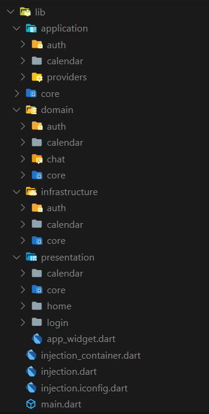

[](https://github.com/Shadow60539/GoogleCalendarClone_Flutter)

# Introduction

> “Google Calendar Clone”
A Google Calendar Clone using Flutter

Before we start, you can take a look at the app:


## Key Features

- [x] Create Events.
- [x] Delete Events
- [x] Update Events.
- [x] Multiple Calendar Views.
- [ ] Dark Theme


## How To Use

To clone and run this application, you'll need [Git](https://git-scm.com) and [Flutter](https://flutter.dev/docs/get-started/install) installed on your computer. From your command line:

```bash
# Clone this repository
$ git clone https://github.com/Shadow60539/GoogleCalendarClone_Flutter.git

# Go into the repository
$ cd GoogleCalendarClone_Flutter

# Paste google-services.json file to /android/app

# Add your google calendar client_id to .env_sample and rename it to .env

# Install dependencies
$ flutter packages get

# Run the app
$ flutter run
```


### Packages


Some very good packages are used in the project.


Below are the information about these packages.


package | explain
---|---
[animations](https://pub.flutter-io.cn/packages/animations) | Animations
[auto_route](https://pub.flutter-io.cn/packages/auto_route) | Navigations
[auto_route_generator](https://pub.flutter-io.cn/packages/hive_generator) | Navigations Generator
[font_awesome_flutter](https://pub.flutter-io.cn/packages/font_awesome_flutter) | Awesome icons
[dio](https://pub.flutter-io.cn/packages/dio) | Network
[calendar_views](https://pub.flutter-io.cn/packages/calendar_views) | Calendar 
[cloud_firestore](https://pub.flutter-io.cn/packages/cloud_firestore) | Firestore 
[firebase_auth](https://pub.flutter-io.cn/packages/firebase_auth) | Firebase Authentication 
[firebase_core](https://pub.flutter-io.cn/packages/firebase_core) | Firebase Core 
[flushbar](https://pub.flutter-io.cn/packages/flushbar) | Custom Snackbar 
[flutter_config](https://pub.flutter-io.cn/packages/flutter_config) | Flutter Config 
[flutter_svg](https://pub.flutter-io.cn/packages/flutter_svg) | Svg Support 
[google_sign_in](https://pub.flutter-io.cn/packages/google_sign_in) | Google Signin 
[googleapis](https://pub.flutter-io.cn/packages/googleapis) | Google APIs
[flutter_bloc](https://pub.flutter-io.cn/packages/flutter_bloc) | Bloc Pattern
[get_it](https://pub.flutter-io.cn/packages/cget_it) | Service Locator
[dartz](https://pub.flutter-io.cn/packages/dartz) | Functional Programming Support
[injectable](https://pub.flutter-io.cn/packages/injectable) | Code Generator for get_it
[lottie](https://pub.flutter-io.cn/packages/lottie) | Lottie files animations
[google_fonts](https://pub.flutter-io.cn/packages/google_fonts) | Google fonts 
[freezed](https://pub.flutter-io.cn/packages/freezed) | Code generation for immutable classes
[injectable_generator](https://pub.flutter-io.cn/packages/injectable_generator) | Generator for injectable
[lint](https://pub.flutter-io.cn/packages/lint) | Rules handler for Dart
[build_runner](https://pub.flutter-io.cn/packages/build_runner) | Build Custom Models

### Directory Structure

The project directory structure is as follows:

```
├── android
├── asset
├── build
├── images
├── ios
├── lib
├── pubspec.lock
├── pubspec.yaml

```


Let me explain the other directories besides **lib**:

directory | explain
---|---
images | readme images files
asset | images and lottie files

Then the lib directory





directory | explain
---|---
core | Global Classes
data | Fetching data from backend
domain | Converting raw json data into models -DTOs
application | State Management 
presentation | UI

